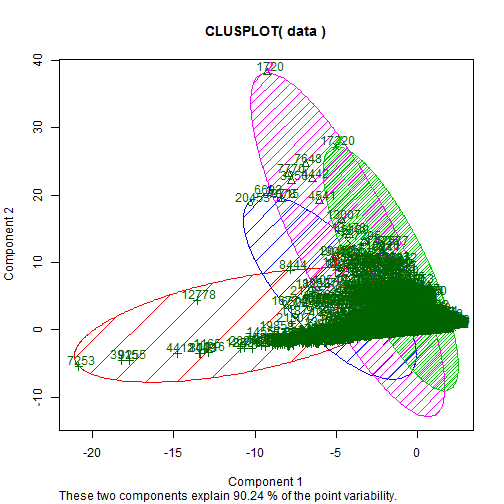

On line data classification Application
========================================================
author: Courera student
date: Jan 27/1015

Application structure
========================================================

This simple on-line application will read a csv file, and plot the classification results.The application mainly contains 3 parts:

- UI
- Server
- Help file

UI 
========================================================

The UI mainly contains the following components:

- File Input to read the textfile
- Checkbox Input indicating whether the text file has a header
- Radio button to select the separator for the text file
- Radio button to select the classification method
- Numeric input for numberof class if the classification method is "k means clustering"
- A link for help file

Server
========================================================

The following is a claasification example using "k means clustering" method for a class of 4:


```r
library(cluster)
data<- read.csv("kc_house_data.csv")
kc<- kmeans(data,centers=4)
clusplot(data,kc$cluster,color=TRUE,shade=TRUE,labels =2)
```




Help file
========================================================

The help file contains a step by step guide and a simple instructions on the usage of the application.
